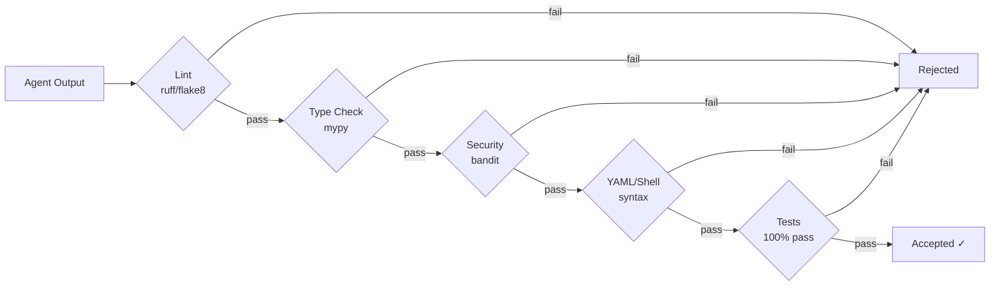

# Agent Governance Framework

**Grand Unified AI Home Lab — Project Chimera**

> *An isolated agent is a safe agent.*

This document describes the Agent Instruction Framework: the rules, tools, hooks, and quality gates that govern every automated agent operating in this homelab.  Read this before writing code that touches any agent, pipeline, or deployment script.

---

## Table of Contents

1. [Overview](#overview)
2. [Execution Modes](#execution-modes)
3. [Agent Roles](#agent-roles)
4. [Hooks](#hooks)
5. [Quality Gates](#quality-gates)
6. [Testing Policy](#testing-policy)
7. [Standardisation](#standardisation)
8. [Per-Agent Isolation](#per-agent-isolation)
9. [Hard Blocks](#hard-blocks)
10. [Agent Memory Layer](#agent-memory-layer)
11. [Approval Workflow](#approval-workflow)
12. [Audit & Logging](#audit--logging)
13. [Quickstart](#quickstart)
14. [Troubleshooting](#troubleshooting)

---

## Overview

The Agent Instruction Framework answers six questions:

| Question | Answer |
|---|---|
| Who runs what? | **Roles** define scope (planner / operator / auditor) |
| How powerful is the agent? | **Execution modes** (SAFE / DRYRUN / ARMED) |
| What is checked before a commit? | **Hooks** (pre-commit, post-commit, pre-push) |
| What must pass before merging? | **Quality gates** (lint, type-check, security, tests) |
| What can *never* happen? | **Hard blocks** (irrevocable restrictions) |
| How are agents kept separate? | **Per-agent isolation** (worktrees / containers) |

All settings live in [`agent-governance/agent-config.yml`](../agent-governance/agent-config.yml).

---

## Execution Modes

Set via the `AGENT_MODE` environment variable.  Default: **`SAFE`**.

| Mode | Description | Allowed operations |
|---|---|---|
| `SAFE` | Read-only observation; no mutations | File reads, planning, analysis |
| `DRYRUN` | Simulate actions; log what *would* happen | Read + GET/HEAD network calls |
| `ARMED` | Full execution; write operations allowed | Everything — with approval gates for destructive actions |

```bash
# Start an agent in DRYRUN mode
AGENT_MODE=DRYRUN AGENT_ROLE=operator ./scripts/deploy-renegade-node.sh --dry-run
```

Escalating from `SAFE` → `ARMED` always requires human confirmation stored in the audit log.

---

## Agent Roles

| Role | Scope | Allowed modes |
|---|---|---|
| **planner** | Decomposes tasks; never executes | SAFE, DRYRUN |
| **operator** | Implements plans; reads & writes | DRYRUN, ARMED |
| **auditor** | Reviews output; read-only | SAFE |

Roles are enforced by the pre-commit hook.  An agent claiming the `operator` role but running in `SAFE` mode will have any write operations silently no-oped.

---

## Hooks

Automated hooks run at specific points in the development lifecycle.

### Installation

```bash
# Option A — use the pre-commit framework (recommended)
pip install pre-commit
pre-commit install

# Option B — copy scripts directly
cp agent-governance/hooks/pre-commit .git/hooks/pre-commit
cp agent-governance/hooks/destructive-check.sh .git/hooks/destructive-check.sh
chmod +x .git/hooks/pre-commit .git/hooks/destructive-check.sh
```

### Pre-commit Hooks

Run on every `git commit`:

| Hook | What it checks |
|---|---|
| Destructive change detection | Blocks `rm -rf` on system paths, force-push, disk formatters, SQL `DROP` without safeguards |
| YAML syntax | All staged `.yml` / `.yaml` files parsed by `yaml.safe_load` |
| Shell syntax | All staged `.sh` files validated with `bash -n` |
| Python linting | `ruff` (or `flake8` as fallback) on staged `.py` files |
| Security scan | `bandit` on staged `.py` files |
| Secrets detection | Regex scan for hardcoded passwords, API keys, private keys |
| Policy validation | `agent-config.yml` schema is valid and contains all required keys |
| Agent activity log | Appends a JSON log entry when `AGENT_ID` env var is set |

### Pre-push Hooks

Run on `git push` (via pre-commit framework):

- Full test suite (`./validate.sh` + Python invariant tests)
- Security scan of the entire changed diff

### Bypassing a Block

In exceptional cases, a hard block may be bypassed with explicit human approval:

```bash
AGENT_OVERRIDE=1 git commit -m "approved: <reason>"
```

The override **must** be accompanied by a written justification in the commit message and will be recorded in the audit log at `/var/log/agent-governance/activity.jsonl`.

---

## Quality Gates

Every agent output must pass **all** enabled gates before it is merged.



### CI Pipeline

The GitHub Actions workflow (`.github/workflows/validate.yml`) enforces:

1. **YAML syntax** — all compose files and configs
2. **Shell syntax** — all `.sh` scripts
3. **Python linting** — `ruff` on all `.py` files
4. **Security scanning** — `bandit` on all `.py` files
5. **Repo invariant tests** — `python -m unittest discover`
6. **Integration validation** — `./validate.sh` (335+ checks)

Agents **cannot proceed** until all gates pass.

---

## Testing Policy

### Anti-mocking Rule

> **Never mock what you can use for real.**

- Use real Docker containers in integration tests (Testcontainers or local Docker).
- Use real file I/O; never `mock.patch` filesystem calls in tests that validate file operations.
- Use real network ports in health-check tests; mock only third-party APIs that cost money or have rate limits.

### Coverage Target

Target: **100%** for new code written by agents.  The CI pipeline enforces that test coverage does not *decrease* on PRs touching `kvm-operator/`, `brothers-keeper/`, or `agent-governance/`.

### Failure Protocol

1. A failing test is a hard stop — no merging.
2. The responsible agent must diagnose and fix the failure before proceeding.
3. Flaky tests (intermittent failures) must be fixed or quarantined with a tracking issue; they are never simply skipped.

---

## Standardisation

| Question | Answer |
|---|---|
| Where are issues tracked? | GitHub Issues in this repository |
| Where do agent learnings go? | Qdrant collection `agent_learnings` (see Memory Layer) |
| Where do agents do their work? | Per-agent Git worktrees under `/tmp/agent-workspace/<agent_id>` |
| Who reviews agent output? | A human auditor (or the `auditor` agent role) must approve any ARMED-mode PR |
| What is the PR template? | What changed · Why · How tested · Risks · Rollback |

---

## Per-Agent Isolation

Each agent runs in its own isolated environment to prevent cross-agent corruption.

```
/tmp/agent-workspace/
├── planner-<uuid>/      ← git worktree for planning agents
├── operator-<uuid>/     ← git worktree for operator agents
└── auditor-<uuid>/      ← git worktree for auditor agents
```

### Resource Limits (Docker)

```yaml
deploy:
  resources:
    limits:
      cpus: "0.5"
      memory: 2g
    reservations:
      cpus: "0.25"
      memory: 512m
```

### Network Isolation

Agents use an `internal` Docker network by default.  Access to external IPs requires the operator to explicitly use the `ai_public` network and declare it in `agent-config.yml`.

### Mount Restrictions

| Path | Policy |
|---|---|
| `/etc` | Denied |
| `/root` | Denied |
| `/var/run/docker.sock` | Denied (use Portainer API instead) |
| `/tmp/agent-workspace` | Allowed (read/write scratch space) |
| `/mnt/brain_memory` | Allowed (read/write knowledge base) |

---

## Hard Blocks

These restrictions are non-negotiable and enforced by hooks and CI.  No agent role or execution mode can override them without human approval.

| ID | Pattern | Action |
|---|---|---|
| `no_direct_push` | `git push` (direct) | Block |
| `no_force_push` | `git push --force` | Block |
| `no_rm_rf_system` | `rm -rf /etc`, `/usr`, etc. | Block |
| `no_rm_rf_home` | `rm -rf ~/` | Block |
| `no_disk_format` | `mkfs.*`, `dd if=/dev/zero`, `shred` | Block |
| `no_raw_sql_delete` | `DROP TABLE`, `TRUNCATE`, `DELETE` without `WHERE` | Block |
| `no_hardcoded_secrets` | `password = "…"` in source | Block |
| `no_external_exfil` | `curl … \| nc`, `wget … \| sh` | Block |

---

## Agent Memory Layer

Agents persist knowledge in a [Qdrant](https://qdrant.tech) vector database.

| Collection | Contents | Retention |
|---|---|---|
| `agent_task_logs` | Structured log of every task executed | 90 days |
| `agent_tool_history` | Tool calls and their outcomes | 30 days |
| `agent_learnings` | Distilled facts, patterns, pitfalls | 365 days |

### Pruning

A weekly job clusters and merges redundant vectors (similarity > 0.92), deleting low-value entries.  Vectors tagged `important` are exempt.

Pruning is handled by the `brain-evolution` service in `agent-governance/sovereign-brain-compose.yml`.

---

## Approval Workflow

Certain operations require a human to explicitly approve before execution:

- Destructive commands
- Production deployments
- External network writes
- Schema migrations
- Direct `git push`

Approvals time out after 300 seconds.  Auto-deny on timeout is **enabled** to prevent unattended destructive operations.

Approval records are stored at `/var/log/agent-governance/approvals.jsonl`.

---

## Audit & Logging

Every agent action is logged in structured JSON format:

```json
{
  "timestamp": "2026-03-05T23:01:00Z",
  "agent_id": "operator-abc123",
  "agent_role": "operator",
  "execution_mode": "ARMED",
  "action": "deploy_stack",
  "outcome": "success",
  "duration_ms": 4231
}
```

Log destinations:
1. `/var/log/agent-governance/activity.jsonl` (file, rotated daily, kept 30 days)
2. Qdrant `agent_task_logs` collection (embedded for semantic search)

---

## Quickstart

```bash
# 1. Install hooks
pip install pre-commit
pre-commit install

# 2. Verify hooks work
pre-commit run --all-files

# 3. Deploy the Brain Node (dry-run first)
./scripts/deploy-renegade-node.sh --dry-run

# 4. Deploy for real (requires root on target node)
sudo ./scripts/deploy-renegade-node.sh

# 5. Run the full test suite
./validate.sh
python -m unittest discover -s tests -p "test_*.py" -v
```

---

## Troubleshooting

| Symptom | Fix |
|---|---|
| Pre-commit hook not running | `pre-commit install` or `chmod +x .git/hooks/pre-commit` |
| `bandit` not found | `pip install bandit` |
| `ruff` not found | `pip install ruff` |
| Destructive check false-positive | Review diff; use `AGENT_OVERRIDE=1` with documented justification |
| Qdrant unreachable | `docker compose -f agent-governance/sovereign-brain-compose.yml ps brain-qdrant` |
| Brain node NFS mount fails | Check Unraid NFS exports: `showmount -e 192.168.1.222` |
| `WEBUI_SECRET_KEY` missing | `openssl rand -hex 32` and add to `.env` |

---

*Last updated: 2026-03-05 — Agent Instruction Framework v1.0*
