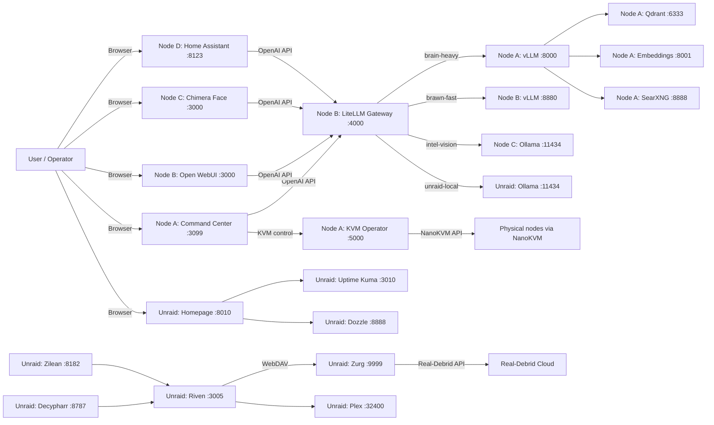
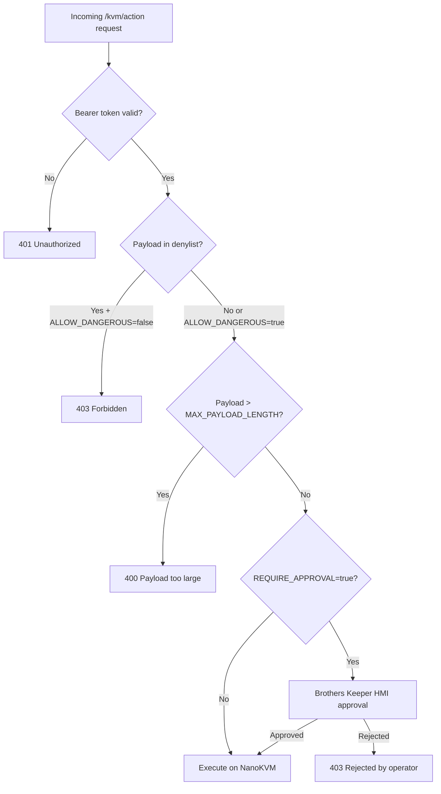
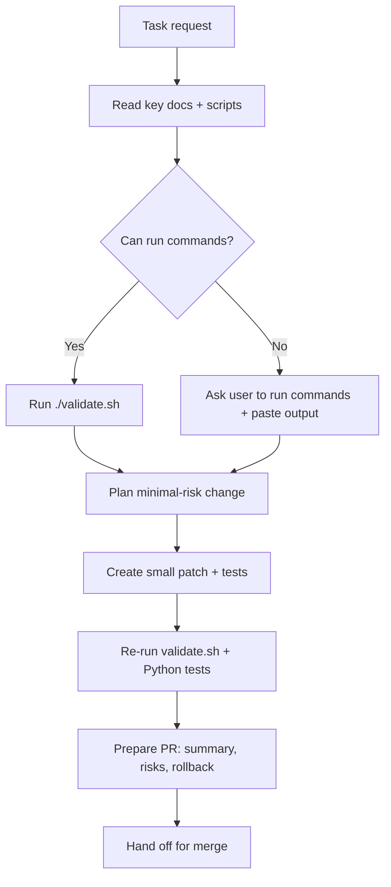
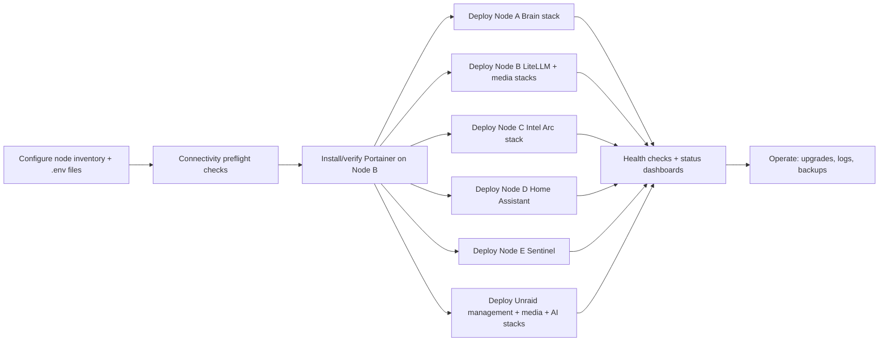

# Architecture

This is the canonical, high-level architecture reference for the **Grand Unified AI Home Lab** (`onemoreytry`).

---

## Node map

| Node | Hostname / IP | Role | Key services |
|------|--------------|------|--------------|
| **Node A** | 192.168.1.9 | Brain (AMD RX 7900 XT) | vLLM (ROCm), Open WebUI, Qdrant, SearXNG, Embeddings, Command Center (port 3099) |
| **Node B** | 192.168.1.222 | Brawn / Gateway (RTX 4070) | LiteLLM Gateway (port 4000), Portainer, OpenClaw, media stacks |
| **Node C** | 192.168.1.6 | Intel Arc Vision | Ollama (Intel Arc SYCL), Open WebUI (Chimera Face) |
| **Node D** | 192.168.1.149 | Home Assistant | HA Core (port 8123), AI conversation via LiteLLM |
| **Node E** | 192.168.1.116 | Sentinel (Frigate/cameras) | Frigate NVR, Blue Iris relay |
| **Unraid** | 192.168.1.222 | Media Server + AI Machine | Homepage, Uptime Kuma, Dozzle, Watchtower, Tailscale + DUMB AIO media stack (Plex, Riven, Decypharr, Zurg, rclone, Zilean) + Ollama + Open WebUI |

> **Note:** Unraid and Node B share the same physical IP (192.168.1.222) in the reference homelab — Node B is a VM/Docker host on the same Unraid machine.

---

## High-level service graph



---

## Safety model (KVM operator)

KVM write operations are protected at three layers:

1. **Token auth** — every request must carry `KVM_OPERATOR_TOKEN` as a bearer token.
2. **Approval gate** — `REQUIRE_APPROVAL=true` (default) blocks headless write operations; a human must confirm via the Brothers Keeper HMI.
3. **Denylist** — `policy_denylist.txt` blocks destructive command patterns (disk wipe, `rm -rf /`, fork bombs, shutdown, etc.) unless `ALLOW_DANGEROUS=true`.
4. **Payload size limit** — `MAX_PAYLOAD_LENGTH` (default 4096 chars) prevents oversized HID injections.

See `kvm-operator/app.py` and `kvm-operator/policy_denylist.txt` for the source of truth.



---

## DUMB AIO media pipeline (Unraid)

Real-Debrid cached-only streaming pipeline:

```mermaid
flowchart LR
  RD[Real-Debrid Cloud] <-->|API| ZG[Zurg WebDAV :9999]
  ZG <-->|FUSE mount| RC[rclone → /mnt/debrid/real_debrid]
  RC --> RV[Riven — symlink manager :3005]
  ZL[Zilean — DMM hash search :8182] --> RV
  DC[Decypharr — grab agent :8787] --> RV
  RV --> SL[/mnt/debrid/riven_symlinks]
  SL --> PL[Plex :32400]
```

---

## Port reference

| Port | Service | Node |
|------|---------|------|
| 3099 | Node A Command Center | Node A (192.168.1.9) |
| 8000 | vLLM (brain) | Node A |
| 8001 | Embeddings (TEI) | Node A |
| 6333 | Qdrant REST | Node A |
| 6334 | Qdrant gRPC | Node A |
| 8888 | SearXNG | Node A |
| 5000 | KVM Operator | Node A |
| 4000 | LiteLLM Gateway | Node B (192.168.1.222) |
| 8880 | vLLM (brawn) | Node B |
| 9000 | Portainer | Node B |
| 11434 | Ollama (Intel Arc) | Node C (192.168.1.6) |
| 3000 | Chimera Face (Open WebUI) | Node C |
| 8123 | Home Assistant | Node D (192.168.1.149) |
| 8010 | Homepage | Unraid (192.168.1.222) |
| 3010 | Uptime Kuma | Unraid |
| 8888 | Dozzle | Unraid |
| 11434 | Ollama (Unraid) | Unraid |
| 3020 | Open WebUI (Unraid) | Unraid |
| 3005 | Riven | Unraid |
| 3006 | Riven Frontend | Unraid |
| 8787 | Decypharr | Unraid |
| 8182 | Zilean | Unraid |
| 9999 | Zurg | Unraid |
| 32400 | Plex | Unraid |
| 7070 | Brothers Keeper | Node A |

---

## Agent execution workflow



---

## Multi-node deployment flow



---

## Source of truth files

| Concern | File |
|---------|------|
| Repo invariants / CI validation | `validate.sh` |
| Python invariant tests | `tests/test_repo_invariants.py` |
| KVM safety policy | `kvm-operator/policy_denylist.txt` |
| KVM operator | `kvm-operator/app.py` |
| Node A Brain stack | `node-a-vllm/docker-compose.yml` |
| Node B LiteLLM gateway | `node-b-litellm/litellm-stack.yml` |
| Node C Intel Arc | `node-c-arc/docker-compose.yml` |
| Node D Home Assistant | `node-d-home-assistant/docker-compose.yml` |
| Unraid management stack | `unraid/docker-compose.yml` |
| Unraid media stack (DUMB AIO) | `unraid/media-stack.yml` |
| Unraid AI stack | `unraid/ai-stack.yml` |
| Node inventory wizard | `scripts/setup-env.sh` |
| Multi-node deploy | `scripts/deploy-all.sh` |
| Brothers Keeper HMI | `brothers-keeper/` |
| CI workflow | `.github/workflows/validate.yml` |
| Agent instructions | `.github/copilot-instructions.md` |
