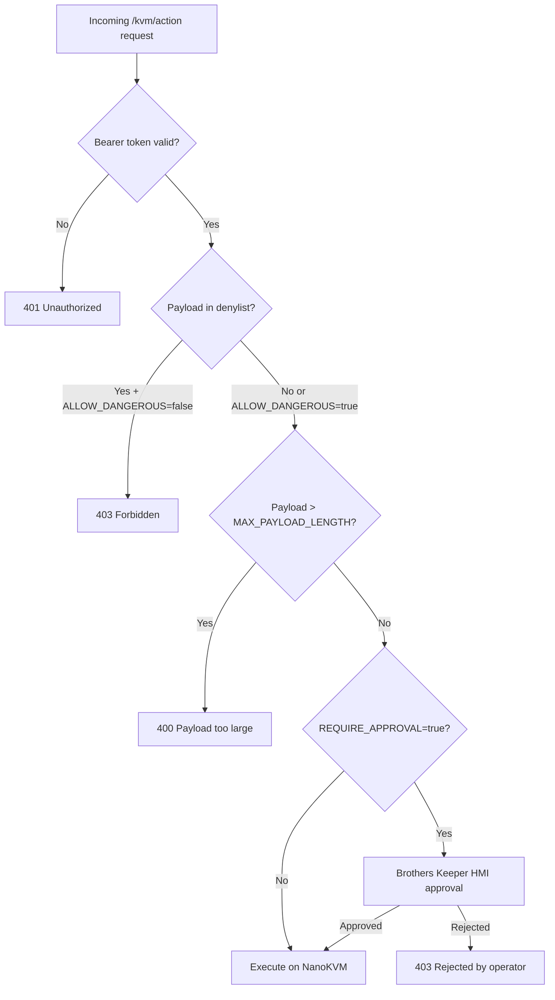
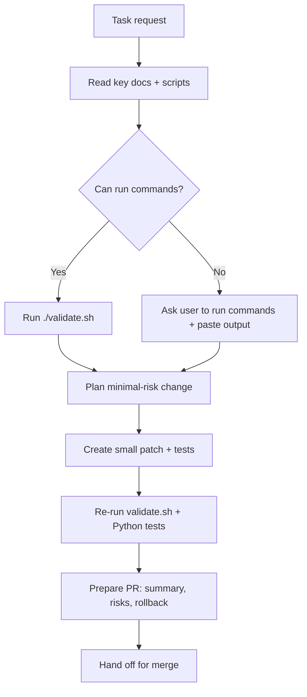

# Architecture

This is the canonical, high-level architecture reference for the **Grand Unified AI Home Lab** (`onemoreytry`).

**Authority:** `docs/ARCHITECTURE_CANONICAL_2026.md` is the baseline source of truth.

---

## Status taxonomy

- **canonical**: Required default path for normal installs and operations.
- **optional**: Supported add-on not required for baseline functionality.
- **legacy**: Older path kept for compatibility/migration.
- **experimental**: Test-only path; not baseline.

---

## Node map

| Node | Hostname / IP | Role | Key services |
|------|--------------|------|--------------|
| **Node A** | 192.168.1.9 | Inference (**canonical**) | Ollama (primary endpoint) |
| **Node B** | 192.168.1.222 | Operations / orchestration (**canonical**) | Portainer (port 9000), n8n (port 5678), Ollama |
| **Node C** | 192.168.1.6 | User interface (**canonical**) | Single Open WebUI (port 3000), Ollama |
| **Node D** | 192.168.1.149 | Home automation (**canonical**) | HA Core (port 8123), direct Ollama integration |
| **Node E** | 192.168.1.116 | Surveillance / extensions (**optional**) | Frigate / Blue Iris relay |
| **Unraid** | 192.168.1.222 | Infrastructure host (**optional**) | Homepage, Uptime Kuma, Dozzle, media stack |

> **Default policy:** LiteLLM, vLLM, and OpenClaw are not default routing components; treat them as **legacy/advanced** unless a guide explicitly requires them.

---

## High-level service graph

```mermaid
flowchart LR
  U[User / Operator] -->|Browser| WC[Node C: Open WebUI :3000]
  U -->|Browser| HA[Node D: Home Assistant :8123]
  U -->|Browser| PB[Node B: Portainer :9000]
  U -->|Browser| NB[Node B: n8n :5678]

  WC --> OA[Node A: Ollama :11434]
  WC --> OB[Node B: Ollama :11434]
  WC --> OC[Node C: Ollama :11434]

  HA -->|Direct Ollama API| OA
  HA -->|Direct Ollama API (failover)| OB

  PB --> Ops[Container Ops / Deployments]
  NB --> Auto[Automation Workflows]

  E[Node E Optional Services] --> WC
```

---

## Safety model (KVM operator)

KVM write operations are protected at three layers:

1. **Token auth** — every request must carry `KVM_OPERATOR_TOKEN` as a bearer token.
2. **Approval gate** — `REQUIRE_APPROVAL=true` (default) blocks headless write operations; a human must confirm via the Brothers Keeper HMI.
3. **Denylist** — `policy_denylist.txt` blocks destructive command patterns (disk wipe, `rm -rf /`, fork bombs, shutdown, etc.) unless `ALLOW_DANGEROUS=true`.
4. **Payload size limit** — `MAX_PAYLOAD_LENGTH` (default 4096 chars) prevents oversized HID injections.

See `kvm-operator/app.py` and `kvm-operator/policy_denylist.txt` for the source of truth.



---

## DUMB AIO media pipeline (Unraid)

Real-Debrid cached-only streaming pipeline:

```mermaid
flowchart LR
  RD[Real-Debrid Cloud] <-->|API| ZG[Zurg WebDAV :9999]
  ZG <-->|FUSE mount| RC[rclone → /mnt/debrid/real_debrid]
  RC --> RV[Riven — symlink manager :3005]
  ZL[Zilean — DMM hash search :8182] --> RV
  DC[Decypharr — grab agent :8787] --> RV
  RV --> SL[/mnt/debrid/riven_symlinks]
  SL --> PL[Plex :32400]
```

---

## Port reference

| Port | Service | Node | Status |
|------|---------|------|--------|
| 11434 | Ollama | Node A | canonical |
| 11434 | Ollama | Node B | canonical |
| 11434 | Ollama | Node C | canonical |
| 3000 | Open WebUI (single shared instance) | Node C | canonical |
| 9000 | Portainer | Node B | canonical |
| 5678 | n8n | Node B | canonical |
| 8123 | Home Assistant | Node D | canonical |
| 81 | Blue Iris | Node E | optional |
| 5000 | KVM Operator | Node A | optional |
| 4000 | LiteLLM Gateway | Node B | legacy |
| 8000 | vLLM (brain route) | Node A | legacy |
| 8880 | vLLM (brawn route) | Node B | legacy |
| 3005 | OpenClaw/Sentinel (env-specific) | Node E/B | legacy |
| 8010 | Homepage | Unraid | optional |
| 3010 | Uptime Kuma | Unraid | optional |


---

## Agent execution workflow



---

## Multi-node deployment flow

```mermaid
flowchart LR
  Inv[Configure node inventory + .env files] --> Pre[Connectivity preflight checks]
  Pre --> B[Install Portainer + n8n on Node B]
  B --> O[Deploy Ollama on Nodes A/B/C]
  O --> W[Deploy single Open WebUI on Node C]
  W --> H[Configure Home Assistant direct to Ollama endpoint]
  H --> E[Deploy optional Node E surveillance services]
  E --> V[Health checks + dashboards]
  V --> Op[Operate: upgrades, logs, backups]
```



---

## Source of truth files

| Concern | File |
|---------|------|
| Repo invariants / CI validation | `validate.sh` |
| Python invariant tests | `tests/test_repo_invariants.py` |
| KVM safety policy | `kvm-operator/policy_denylist.txt` |
| KVM operator | `kvm-operator/app.py` |
| Node A Brain stack | `node-a-vllm/docker-compose.yml` |
| Node B LiteLLM gateway | `node-b-litellm/litellm-stack.yml` |
| Node C Intel Arc | `node-c-arc/docker-compose.yml` |
| Node D Home Assistant | `node-d-home-assistant/docker-compose.yml` |
| Unraid management stack | `unraid/docker-compose.yml` |
| Unraid media stack (DUMB AIO) | `unraid/media-stack.yml` |
| Unraid AI stack | `unraid/ai-stack.yml` |
| Node inventory wizard | `scripts/setup-env.sh` |
| Multi-node deploy | `scripts/deploy-all.sh` |
| Brothers Keeper HMI | `brothers-keeper/` |
| CI workflow | `.github/workflows/validate.yml` |
| Agent instructions | `.github/copilot-instructions.md` |
