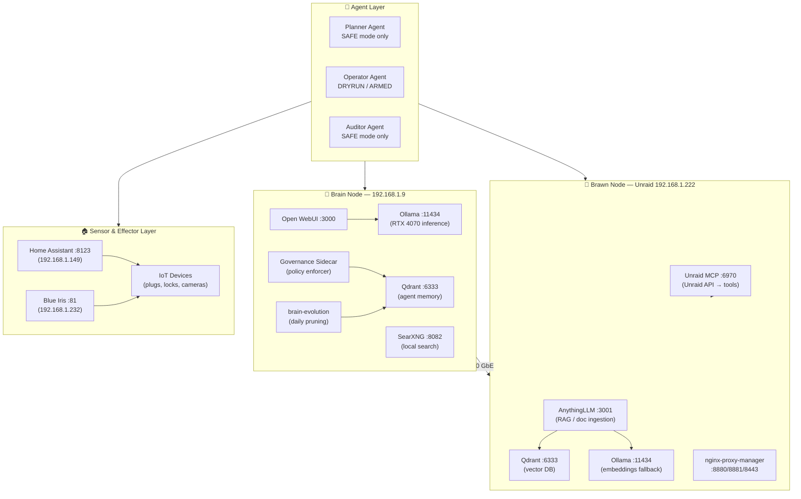

# Sovereign AI Homelab Architecture

**Grand Unified AI Home Lab — Project Chimera**

> *A self-healing, self-evolving AI system that operates at the edge of your network.*

---

## Overview

This document describes the full hardware/software topology, deployment model, and governance layer for the sovereign AI homelab.  The design rejects cloud-mediated cognition in favour of a **local-first, transparent, and self-correcting system**.

The architecture is bifurcated into:

- **Brain Node** — high-performance inference and agent orchestration
- **Brawn Node (Unraid)** — mass storage, media, and infrastructure services

A 10 GbE fibre link connects the two nodes, eliminating I/O bottlenecks during Retrieval-Augmented Generation (RAG) workloads.

---

## Architecture Diagram



---

## Hardware Specifications

### Brain Node — Cognitive Inference Engine

| Component | Specification | Notes |
|---|---|---|
| CPU | Intel i5-13600K | Prioritises single-thread performance for agent loops |
| GPU | NVIDIA RTX 4070 (12 GB) | Dedicated tensor processor; headless mode keeps VRAM free |
| RAM | 96 GB DDR5 | Supports large context windows and in-memory vector indexes |
| Storage | Dual 1 TB NVMe | Scratch space for models and code experiments |
| IP Address | 192.168.1.9 | Static assignment |
| OS | Ubuntu Server 25.10 | Bleeding-edge kernel; headless operation |

**Key configuration details:**

- GPU drivers pinned to `nvidia-headless-580-server` to avoid display packages
- Full Disk Encryption via `systemd-cryptenroll` (TPM seal + SSH fallback via `dropbear` in initramfs)
- Ubuntu 25.10 ships Rust-based coreutils (`uutils`); the deploy script detects and aliases them

### Brawn Node — Storage & Infrastructure

| Component | Specification | Notes |
|---|---|---|
| OS | Unraid 7.2.1 | Parity-protected array + Docker orchestration |
| Storage Array | 22 TB SAS/SATA mix | Long-term archive |
| Cache Pool | 3 TB NVMe | High-speed tier for database writes |
| GPU (Transcoder) | Intel Arc A770 (16 GB) | Media transcoding and batch image tasks |
| IP Address | 192.168.1.222 | Hostname: Unraid-Server |

### Network Fabric

- **10 GbE fibre link** between Brain and Brawn (eliminates RAG I/O bottlenecks)
- Subnet: `192.168.1.0/24`
- IoT devices (plugs, garage doors, cameras) are **effectors** the AI can control via Home Assistant

---

## Docker Compose Stacks

### Brain Node Stack

File: `agent-governance/sovereign-brain-compose.yml`

| Service | Port | Purpose |
|---|---|---|
| `brain-ollama` | 11434 | LLM inference (RTX 4070) |
| `brain-openwebui` | 3000 | Chat UI |
| `brain-qdrant` | 6333 | Vector database |
| `brain-searxng` | 8082 | Privacy-respecting local search |
| `brain-evolution` | — | Daily memory pruning (one-shot, cron-triggered) |
| `brain-governance` | — | Policy enforcer and audit logger |

Deploy:
```bash
# Copy example env and fill in secrets
cp node-a-vllm/.env.example agent-governance/.env
# Generate secrets
openssl rand -hex 32  # → WEBUI_SECRET_KEY
openssl rand -hex 32  # → SEARXNG_SECRET_KEY

docker compose -f agent-governance/sovereign-brain-compose.yml up -d
```

### Brawn Node (Unraid) Sovereign AI Stack

File: `unraid/sovereign-ai-stack.yml`

| Service | Port | Volume | Purpose |
|---|---|---|---|
| `anythingllm` | 3001 | `/mnt/cache/appdata/chimera_ai/anythingllm/storage` | Document ingestion + RAG |
| `chimera-qdrant` | 6333 | `/mnt/cache/appdata/chimera_ai/qdrant` | Vector database |
| `chimera-ollama` | 11434 | `/mnt/cache/appdata/chimera_ai/ollama` | Base LLM (embeddings) |
| `unraid-mcp` | 6970 | — | Unraid API → MCP tools |

Deploy via Portainer → Stacks → Add Stack (paste `unraid/sovereign-ai-stack.yml`).

---

## Unraid MCP Server Integration

Add to OpenWebUI's `config.json` (or the Brain Node WebUI config):

```json
{
  "mcpServers": {
    "unraid-server": {
      "type": "streamable-http",
      "url": "http://192.168.1.222:6970/mcp",
      "disabled": false,
      "autoApprove": ["list_docker_containers", "get_array_status", "get_system_info"]
    }
  }
}
```

Destructive Unraid commands (restart container, stop array, etc.) still require human approval via the governance layer (`REQUIRE_APPROVAL=true` in `unraid-mcp` environment).

---

## Agentic Framework & Self-Evolution

### CodeAct Loop

```
Action → Observation → Correction → Memory Update
```

1. **Action**: execute a task (e.g., scan a subnet, process a document)
2. **Observation**: capture stdout, stderr, and environment results
3. **Correction**: on error, query previous failures from Qdrant, generate a patch, apply, retry (max 3)
4. **Memory Update**: record successful patterns in `agent_learnings` collection

### Dynamic Persona Injection

Agent personality and behaviour are not hardcoded.  A `MasterPromptProfile.json` defines tone, constraints, and allowed tools.  The agent reads this at start-up and may update it when modes change (e.g., switching to a finance-oriented persona).

### Semantic Pruning

- **Schedule**: weekly at 03:00 (systemd timer `brain-evolution.timer`)
- **Strategy**: cluster and merge redundant vectors (similarity > 0.92)
- **Retention**: entries older than 30 days purged unless tagged `important`

---

## Sensor & Effector Integration

### Home Assistant

```bash
# Connection endpoint
ws://192.168.1.149:8123/api/websocket

# Token (stored as env var, never hardcoded)
export HASS_TOKEN="<long-lived-access-token>"
```

- Subscribe to `state_changed` events; push updates into agent context
- Trigger actions (lights, locks, HVAC) via MCP calls with safety checks

### Blue Iris (Camera System)

- **Event trigger**: MQTT message on `BlueIris/+/alert`
- **Image retrieval**: `http://192.168.1.232:81/alerts/{alert_id}&fulljpeg`
- **Analysis**: local vision model classifies objects or identifies threats
- **Response**: act via Home Assistant or send notifications

---

## Installation

### Prerequisites

1. Ubuntu Server 25.10 on Brain Node (`192.168.1.9`)
2. Unraid on Brawn Node (`192.168.1.222`) with NFS share `knowledge_base` exported
3. SSH access from Brain → Brawn
4. Docker + docker-compose-plugin on Brain

### Deploy

```bash
# Clone the repository
git clone https://github.com/Enigmaticjoe/onemoreytry ~/homelab
cd ~/homelab

# Dry-run to preview actions (no changes made)
./scripts/deploy-renegade-node.sh --dry-run

# Full deploy (requires root)
sudo ./scripts/deploy-renegade-node.sh

# Verify
docker compose -f agent-governance/sovereign-brain-compose.yml ps
```

### Skip Flags

```bash
--dry-run     # Preview only
--skip-gpu    # Skip NVIDIA driver installation (already installed)
--skip-mount  # Skip Unraid NFS mount (already configured)
```

---

## Governance Integration

The sovereign AI system is governed by the Agent Instruction Framework.  See [AGENT_GOVERNANCE.md](AGENT_GOVERNANCE.md) for the full design.

| Component | Where |
|---|---|
| Governance config | `agent-governance/agent-config.yml` |
| Pre-commit hooks | `agent-governance/hooks/` |
| Quality gates | `.github/workflows/validate.yml` |
| Audit logs | `/var/log/agent-governance/activity.jsonl` |
| Memory (vector DB) | Qdrant `agent_*` collections |

---

## Rollback

```bash
# Stop all Brain Node services
docker compose -f agent-governance/sovereign-brain-compose.yml down

# Remove NFS mount (if added by deploy script)
sudo umount /mnt/brain_memory
sudo sed -i '/192\.168\.1\.222.*knowledge_base/d' /etc/fstab

# Remove systemd timer
sudo systemctl disable --now brain-evolution.timer
sudo rm -f /etc/systemd/system/brain-evolution.{service,timer}
sudo systemctl daemon-reload
```

---

## FAQ

**Q: Can I run the Brain Node without an NVIDIA GPU?**
A: Yes.  Use `--skip-gpu` and set `NVIDIA_VISIBLE_DEVICES=none` in your `.env`.  Inference will run on CPU (slower).

**Q: How do I change the Ollama model?**
A: `docker exec brain-ollama ollama pull <model-name>`

**Q: Where are the Brain Node logs?**
A: `docker compose -f agent-governance/sovereign-brain-compose.yml logs -f`

**Q: How do I connect OpenWebUI to the Unraid Ollama instance?**
A: Set `OLLAMA_BASE_URL=http://192.168.1.222:11434` in the WebUI environment.

**Q: What if the Unraid MCP container image doesn't exist yet?**
A: The `ghcr.io/unraid/unraid-mcp` image is community-maintained.  Check the Unraid forums for the current recommended image name, or build from source.

---

*Last updated: 2026-03-05 — Sovereign AI Architecture v1.0*
